# ProjectorOS Target Architecture

Status: proposal, 2026-10-07. This describes where ProjectorOS is heading and how to get there in phases without redesigning the system at each step. For the system as it exists today, see [README.md](../README.md) and [AGENTS.md](../AGENTS.md).

## 1. What ProjectorOS is

ProjectorOS turns any surface into an interactive, camera-aware display. It runs on machines ranging from a fanless x86 mini-PC to a GPU workstation or a MacBook, connected to one or more projectors and cameras. It hosts **apps written by third parties** that draw onto physical surfaces and react to what cameras see and to what visitors do on their phones.

The craft cutting-mat assistant is the first app. It is also the reference app: every platform feature should be exercised by it, or by another first-party app, through the same public SDK that third-party developers use.

### 1.1 Principles

1. **Local-first, offline by default.** A complete installation works with no internet, no accounts, no registration and no payments. Cloud services, authentication, licensing and monetization are optional extensions, never requirements.
2. **Open core.** The platform, SDK, protocol and reference apps are open source (Apache-2.0). Optional central services, such as a public app catalog or relays, may exist later, but only behind open extension interfaces that anyone can implement or self-host.
3. **Apps are untrusted.** Third-party code runs sandboxed, gets only the data it was granted, and cannot affect the platform's stability, its UI or other apps.
4. **Physical truth, flexible views.** The canonical world is physical: metres in a scene, millimetres on a surface. Apps choose the units they work in (mm, normalized, virtual px), the way CSS lets authors choose units over one layout engine.
5. **Ask for meaning, not hardware.** Apps request capabilities such as `hands` or `touch`, never "camera 2". The platform decides how to provide them on the hardware it has.
6. **Degrade gracefully.** The same app runs on weak and strong hardware. It receives fewer or slower capabilities on weaker machines, and is told exactly what it got.
7. **Leave room for the hard features.** Irregular surfaces, multi-projector edge blending, stereo and IR sensing, and multi-machine setups are not built early, but the data model and process boundaries are chosen now so that adding them does not force a redesign.

### 1.2 Non-goals

- Not a general-purpose desktop or a web browser.
- Not a video-mapping show-control tool for timeline-driven media. Interop with those tools is welcome, but it is not the core use case.
- No mandatory central service of any kind.

## 2. People and trust

There are three kinds of people. Their trust levels drive the security model.

| Role | Owns | Typically does | Trust |
|---|---|---|---|
| **Space owner** | The machine, projectors, cameras, the room | Installs ProjectorOS, calibrates, installs apps, decides what apps may access | Full control of the device |
| **App author / operator** | Their apps; sometimes comes in to run a session | Builds apps; on site, loads and runs apps within what the owner allows | Trusted with what the owner delegates, never more |
| **Visitor** | Only their own phone | Watches, interacts with their body, joins from a phone via QR code, possibly over cellular from outside the local network | Anonymous and untrusted |

In a home setup one person is often all three roles, and the system must not force them through ceremony meant for public venues. The default for a single-person install is: the person at the device is the owner, with no login.

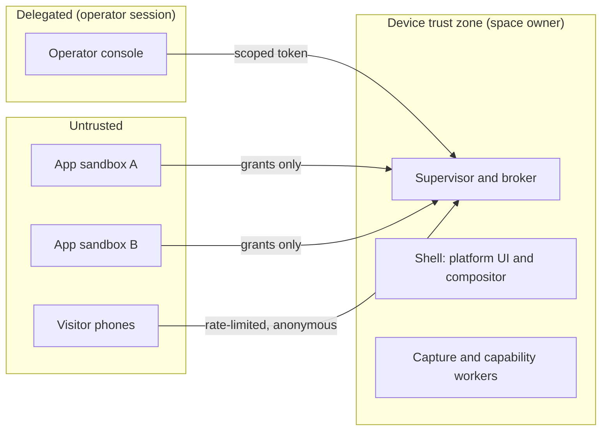

Consequences:

- Permission prompts for sensitive capabilities, such as raw camera video, go to the **owner** (or an operator the owner delegated to), never to visitors, because visitors are being sensed but don't own the device.
- Visitors never authenticate by default. They join a session with a code or QR link, and get an ephemeral, anonymous session identity scoped to that session.
- Platform UI (calibration, operator controls, permission prompts, connection QR codes) always renders above apps, and apps cannot imitate it.

## 3. System overview

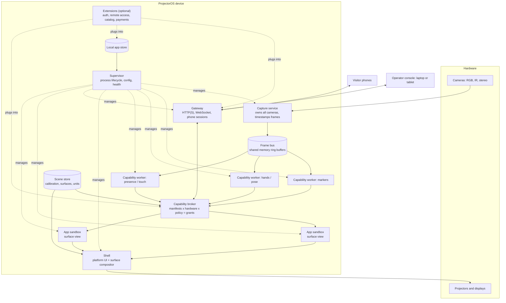

| Component | Responsibility | Today's equivalent |
|---|---|---|
| Supervisor | Starts, watches and restarts every other process; owns configuration; exposes health | `scripts/start.sh` plus `server/main.py` lifespan |
| Capture service | The only process that opens cameras; timestamps frames at capture; publishes frames to the frame bus | `server/camera.py` |
| Frame bus | Zero-copy, same-machine frame sharing via shared-memory ring buffers | none (in-process) |
| Capability workers | One process per capability provider (ArUco, hand landmarks, presence, ...); stateless where possible | `server/detection.py`, called inline in the asyncio loop |
| Capability broker | Negotiates grants, routes capability streams to apps in each app's units, enforces rates and permissions | none |
| Scene store | Versioned scene description: world frame, cameras, projectors, surfaces, warps | `data/calibration.json`, `data/work_surface.json` |
| Gateway | Local HTTP(S) and WebSocket endpoint for the shell, the operator console, apps' companion pages and phones | FastAPI in `server/main.py` |
| Shell | Trusted platform UI and the compositor that maps app surfaces onto projector outputs | `ui/projector/` |
| App sandboxes | One isolated renderer per app, per surface | none (overlays are built into the projector page) |
| Operator console | Owner and operator UI: calibration, apps, permissions, sessions | `ui/index.html` control panel |
| Local app store | Installed app packages, versions, granted permissions | none |

## 4. The scene model

Calibration grows from "two homographies" into a **scene**: a versioned description of the physical setup. Everything spatial in the system is expressed against it.

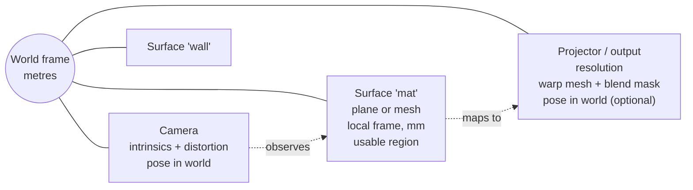

Key points:

- **World frame** in metres. It is optional in simple setups: a single flat surface can act as the world.
- **Surfaces** are named regions apps draw on and receive input in. A surface is a plane (today) or a mesh (later), with its own 2D frame in millimetres, a usable region (today's work-surface rectangle) and an orientation (where "up" is, and the default origin).
- **Cameras** carry intrinsics and a distortion model when calibrated. A camera that has only been calibrated against a surface by homography is still valid, just less capable.
- **Outputs** (projectors or displays) map surface coordinates to output pixels through a **warp mesh**. A homography is stored as a 2x2 mesh, so today's calibration is a degenerate case of the general format. Irregular surfaces and keystone correction later only need denser meshes. Each output also carries an optional **blend mask** for overlap regions with other projectors.

Example (illustrative, not final):

```json
{
  "scene_version": 1,
  "world": { "units": "m" },
  "surfaces": {
    "mat": {
      "kind": "plane",
      "size_mm": [600, 450],
      "region_mm": [[10, 10], [590, 440]],
      "orientation": { "up": "+y", "origin": "top-left" }
    }
  },
  "cameras": {
    "cam0": {
      "device_hint": "FaceTime HD Camera",
      "resolution": [1280, 720],
      "intrinsics": null,
      "surface_maps": { "mat": { "kind": "homography", "H": [[1,0,0],[0,1,0],[0,0,1]] } }
    }
  },
  "outputs": {
    "proj0": {
      "display_hint": "EPSON PJ",
      "resolution": [1920, 1080],
      "surface_maps": {
        "mat": { "kind": "mesh", "grid": [2, 2], "points_px": [[0,0],[1920,0],[0,1080],[1920,1080]] }
      },
      "blend_mask": null
    }
  }
}
```

The scene file is versioned with a migration path, so old calibrations keep loading as the format grows.

## 5. Coordinates and units

The canonical frame is physical. Each app picks how it sees a surface, in its manifest, and can change it at runtime.

| Unit mode | Meaning | Use for |
|---|---|---|
| `mm` | Physical millimetres on the surface | Anything sized to real objects, such as the craft mat |
| `normalized` | 0..1 over the usable region, with a `fit` mode | Resolution-independent visuals |
| `px` | A virtual resolution the app declares, such as 1920x1080, with a `fit` mode | Ports of existing screen-based apps and games |

`fit` follows CSS `object-fit`: `stretch` (x and y scaled independently; angles and circles distort), `contain` (uniform scale, letterboxed) or `cover` (uniform scale, cropped). "px" never means projector pixels, which are uneven under keystone, warp and blending.

The unit choice applies to **everything spatial an app receives**: positions, sizes, velocities and radii, not just points. Apps can always convert with SDK helpers, for example `surface.convert(20, 'mm')` to get a 20 mm hit radius in their own units.

Implementation: the shell applies one transform to an app's root so its coordinate system matches its unit choice. In `mm` mode, 1 CSS `mm` equals 1 physical millimetre on the surface, so `width: 50mm` is literally true. For SVG, the unit choice is a `viewBox`. For WebGL and WebGPU, the SDK provides the matching projection matrix.

3D capabilities, such as body pose in a room, report in the world frame (metres), with helpers to project onto a surface.

## 6. Sensing

### 6.1 Pipeline

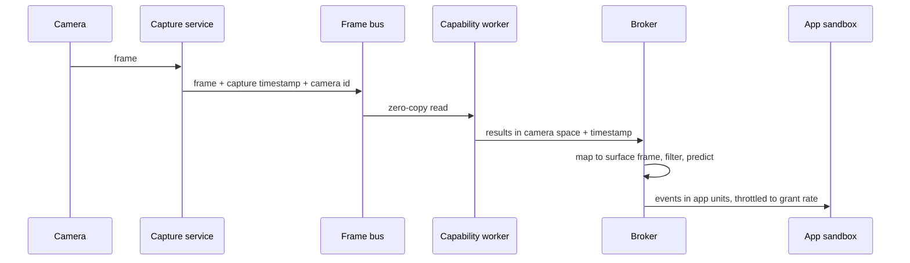

- **One owner per camera.** On Linux, a V4L2 device usually can't be opened by two processes, and on every OS it is simpler to have one capture path. Every consumer, including apps that are granted video, reads from the frame bus.
- **Timestamps from capture.** Every event carries the capture timestamp of the frame it came from, so apps and the broker can predict motion and the system can measure its own latency.
- **Workers are separate processes.** A crashing or slow model can't take down capture or the platform. Workers can be written in any language that can read the frame bus and speak the protocol.
- **Inference runs through ONNX Runtime where possible.** Its execution providers map onto the hardware tiers: CoreML on Macs, OpenVINO on Intel mini-PCs, CUDA or TensorRT on Nvidia, DirectML on Windows. OpenCV remains for classic vision such as ArUco and contours.

### 6.2 Capabilities are semantic, providers are pluggable

An app requests a capability. The broker picks a **provider** that can deliver it on this hardware.

| Capability | What the app gets | Possible providers |
|---|---|---|
| `markers` | Fiducial id, position, rotation on a surface | ArUco/AprilTag on RGB or IR |
| `hands` | Hand landmarks, handedness, on-surface positions | Landmark model on RGB; IR + model |
| `pointers` | Pointer-Events-like stream: fingertips, pens, laser dots, phone cursors | Derived from hands, blobs, phones |
| `touch` | True contact vs hover | IR curtain or IR blob; stereo/depth height above surface. Not available on RGB-only hardware. |
| `presence` | Occupancy, bounding regions, people count | Background model on IR; person segmentation on RGB |
| `pose` | Body skeletons, 2D or 3D | Pose model; stereo for 3D |
| `video` | Camera imagery, in graded levels (section 7.3) | Capture service, possibly with segmentation |

New capabilities and providers are added as worker plugins with a declared contract: the capability's schema, sensor requirements and cost per frame. First-party providers come first; third-party providers are a later phase and run with the same isolation as workers.

### 6.3 The camera sees the projection

Projected content contaminates what an RGB camera sees. This affects capabilities differently, and the broker accounts for it:

- **Markers** are mostly robust, especially with quiet zones and high contrast.
- **Hands** are workable on RGB under moderate projected light.
- **Presence, blobs and touch** are unreliable on RGB over changing content. Reliable providers need **IR**: an IR camera, an IR illuminator, and a filter that blocks visible light, so the projector is invisible to the sensor. Stereo/depth is the other option.
- A future RGB mitigation: subtract the predicted projected image (the platform knows what it projected and the camera-to-output mapping).

IR and stereo hardware is optional. Without it, the broker simply doesn't grant `touch`, and grants `presence` with a quality flag.

## 7. Capability broker and grants

### 7.1 Negotiation

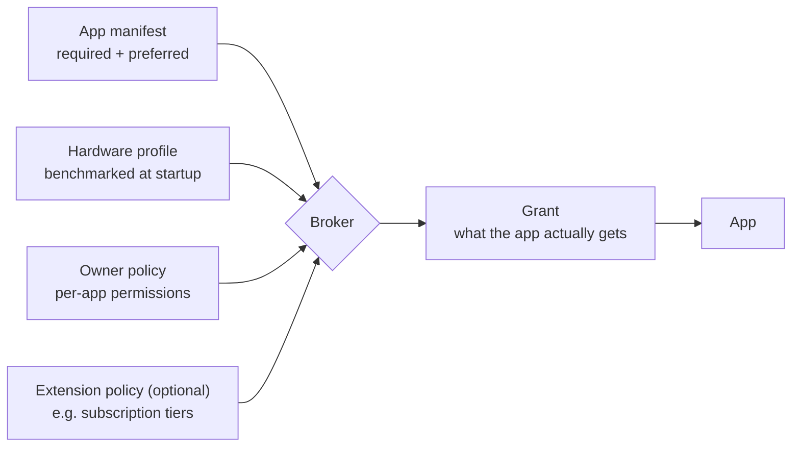

- Apps declare **required** and **preferred** levels, like media constraints in browsers (`min`, `ideal`).
- The **hardware profile** comes from a startup benchmark plus detected devices, not a static list of models.
- The **owner policy** is the space owner's permission decisions.
- An **extension policy** is optional. A future paid tier, for example, is just another policy input, and the core works without any.
- If a required capability can't be granted, the app doesn't start, and the operator sees why. Otherwise the app starts with the best grant and receives `grant.changed` events if conditions change.

### 7.2 Manifest

```json
{
  "id": "org.example.particle-wall",
  "name": "Particle Wall",
  "version": "1.2.0",
  "entry": {
    "surface": "surface/index.html",
    "companion": "phone/index.html"
  },
  "surface": { "units": "normalized", "fit": "contain", "min_size_mm": [400, 300] },
  "capabilities": {
    "hands":   { "required": true, "rate_hz": { "min": 15, "ideal": 30 } },
    "presence": { "required": false },
    "video":   { "required": false, "level": "silhouette" }
  },
  "interaction_class": "direct",
  "network": { "allow": [] },
  "phones": { "max_sessions": 50, "inputs": ["pointer", "buttons"] }
}
```

The grant mirrors the request with actual values, including measured latency for the interaction class, so apps can adapt instead of guessing.

### 7.3 Video access levels

Raw imagery is the most sensitive capability, so it is graded. Each level is a separate permission:

1. `none`: derived data only (the default).
2. `silhouette`: a low-resolution segmentation mask, with no identifying imagery.
3. `low`: downscaled video, for example 320 px wide at 15 fps.
4. `full`: full-resolution video.

Video is delivered as a standard `MediaStream`, so apps use ordinary web APIs. The space owner grants these levels, and the platform shows a persistent indicator on the operator console while any app is receiving video.

### 7.4 Hardware tiers and interaction classes

Hardware tiers are descriptive, not product SKUs:

| Tier | Example | Realistic scope |
|---|---|---|
| Light | Intel N100 mini-PC, integrated GPU | 1 camera, 1 output; markers and hands at reduced rates; light apps |
| Standard | Apple Silicon laptop, mid-range PC | Several cameras; hands and pose at full rate; WebGL apps |
| Heavy | Workstation with discrete GPU | Multiple outputs with warp and blend; stereo; high-fps cameras |

Developers target **interaction classes**:

| Class | Typical use | Requirement |
|---|---|---|
| `ambient` | Presence, crowds, slow visuals | Any tier |
| `direct` | Hands, markers, dragging | Measured photon-to-photon latency reported in the grant; motion prediction available |
| `fast` | Balls, lasers, fast gestures | High-fps cameras (120 fps or more) and a capable tier |

The system measures its own **photon-to-photon latency**: it projects a timed pattern and detects it with the camera. This runs during calibration and on demand, and the result is part of the hardware profile.

## 8. Apps and sandboxing

### 8.1 Package and store

An app is a static web bundle (HTML, JS, WASM, assets) plus `manifest.json`, distributed as a single archive. No server-side code runs on the device for an app.

- **Phase 1: local store.** The owner installs apps from a file, a folder (developer mode) or a URL. The store keeps versions and the owner's permission decisions.
- **Later: catalogs.** Any number of catalog sources (a self-hosted list, a community index, an optional central catalog). Packages can be signed, and the owner can require signatures. Catalogs are an extension, not a core dependency.

### 8.2 Isolation

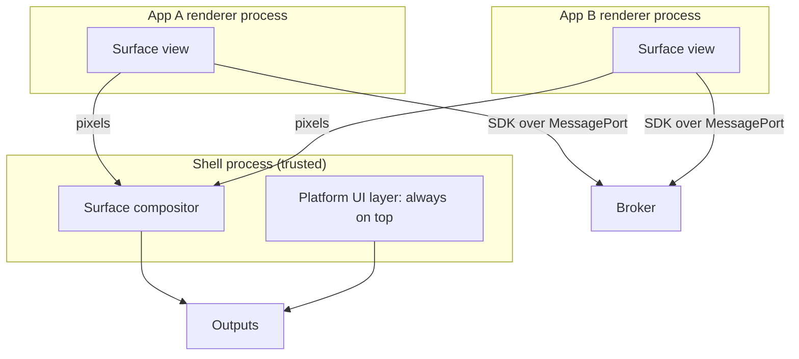

- Each app runs in **its own renderer process**, served from its own origin (for example `app-<id>.local.projectoros`), with no Node access, a strict Content Security Policy, and network access only to hosts listed in the manifest.
- The **only channel** to the platform is the SDK, over a `MessagePort` that the broker controls. There is no shared global and no injected `window.SpatialEngine`.
- The **shell** is trusted and separate. Platform UI renders above all apps. Apps cannot draw outside their surface region.
- **Resource governance:** per-app frame-time and memory monitoring, a watchdog that reloads a hung app, and rate caps on everything an app can send. On light hardware the broker lowers capability rates before the platform itself is starved.

The shell is built on **Electron**, for three reasons: one pinned Chromium on macOS, Linux and Windows; per-app process and session isolation; and offscreen rendering with shared GPU textures, which the warp compositor in section 9 needs. Tauri is not an option because it uses three different engines on three OSes and cannot capture app pixels. This assumption should be confirmed with a technical spike before Phase 5.

### 8.3 App lifecycle

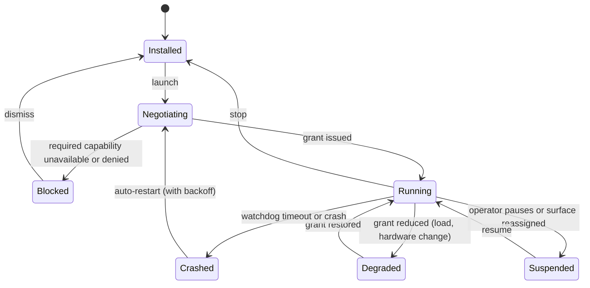

## 9. Rendering and output

Apps draw onto **surfaces**. Only the shell knows about outputs.

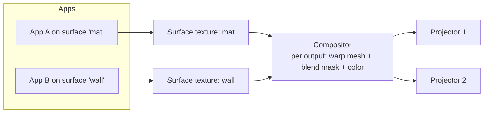

This is delivered in two stages, both behind the same app contract:

| Stage | How | Supports | Phase |
|---|---|---|---|
| A: CSS mapping | Each app's frame gets a `matrix3d()` transform derived from the surface-to-output homography | One output per surface, flat surfaces, homography only | 1 to 4 |
| B: Texture compositor | Apps render offscreen; the shell composites their textures through warp meshes and blend masks with WebGPU | Multiple projectors per surface, edge blending, irregular surfaces, color and brightness matching | 5 |

Moving from A to B changes nothing for apps, because apps never see output pixels in either stage. Projector-side calibration for Stage B uses structured light (Gray-code patterns) to solve dense projector-to-camera correspondences, which also produces the warp meshes.

## 10. SDK

The SDK is an ES module. It is the only public API for apps, and it is versioned with the protocol.

```ts
import { connect } from '@projectoros/sdk';

const pos = await connect();               // handshake with the broker; receives grant
const surface = pos.surface;                // in the units the manifest chose
console.log(pos.grant.capabilities.hands);  // { rate_hz: 30, latency_ms: 85, provider: 'rgb-landmarks' }

// Pointer-Events-like input from every source.
surface.addEventListener('pointerdown', (e) => {
  // e.pointerType: 'hand' | 'marker' | 'blob' | 'phone'
  spawn(e.x, e.y, e.pointerType);
});

// Capability streams.
pos.capabilities.markers.addEventListener('update', (e) => {
  for (const m of e.markers) placeLabel(m.id, m.x, m.y, m.angle);
});

// Prediction compensates for measured latency.
const p = pos.capabilities.hands.predict(handId, performance.now());

// Units.
const hitRadius = surface.convert(20, 'mm');

// Phones (companion pages connect with the same SDK on the phone side).
pos.sessions.addEventListener('message', (e) => applyPhoneInput(e.session, e.data));

// Video, only if granted.
if (pos.grant.capabilities.video?.level === 'silhouette') {
  const stream: MediaStream = await pos.capabilities.video.open();
}
```

Design rules:

- Use web-platform shapes: `EventTarget`, Pointer Events semantics, `MediaStream`, promises.
- Everything is typed. Types are generated from the protocol schema (section 13), not hand-written.
- A **simulator** ships with the SDK: apps can be developed in a normal browser with mouse input standing in for hands and markers, and recorded sensor sessions can be replayed. Most app authors will not own a projector rig.

## 11. Networking and phones

### 11.1 Local-first networking

By default the device serves everything on the local network. No internet connection is needed for any part of a core installation.

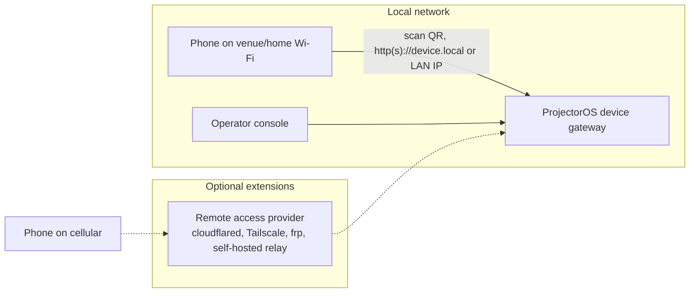

### 11.2 Zero-effort phone join

1. The shell projects a QR code (or the operator console shows one) containing the session URL and a short-lived join code.
2. The visitor scans it. The app's **companion page** opens in the phone's browser. No install, no account.
3. The gateway issues an anonymous session token scoped to that app session. It expires when the session ends.
4. Phone input flows phone, gateway, broker, app, with per-session rate limits and size caps. Phones never talk to an app directly.

The companion page is part of the app package, so app authors build both sides of their experience. It is sandboxed by origin like the surface view.

### 11.3 HTTPS without assuming a cloud

Many web APIs (device orientation, camera, service workers, WebAuthn, clipboard) require a secure context. Plain HTTP on a LAN works for basic touch and buttons, but not for those. There is no zero-effort way to get a publicly trusted certificate on a fully offline device, so HTTPS is tiered:

| Mode | How | Phone experience | Needs |
|---|---|---|---|
| Plain local | HTTP on LAN | Works for pointer and button input; no secure-context APIs | Nothing |
| Owner domain | The owner points a domain they control at the device's LAN address; ACME DNS-01 obtains a certificate (renewed while online, usable offline until expiry) | Full HTTPS, zero effort for visitors | A domain, occasional internet |
| Local CA | The device creates its own CA | Visitors must install a certificate, so not zero-effort | Nothing; suited to owner-only devices |
| Optional provider | A future extension, for example a community-run `*.device` naming service in the style of Plex's `plex.direct` | Full HTTPS, zero effort | That provider |

Remote access for cellular phones is an extension with pluggable providers. The core never depends on a specific one.

### 11.4 Audience scale

| Profile | Audience | Transport | Notes |
|---|---|---|---|
| Interactive | 1 to 15 | Local WebSocket; WebRTC DataChannel (unordered) later for high-rate input | Realistic latency 30 to 60 ms from phones; use client prediction. Under 16 ms is not achievable over Wi-Fi. |
| Room | 15 to 100 | Local WebSocket with input throttling and server-side aggregation | Remote participants via a remote-access extension |
| Broadcast | 100 to 10,000+ | Requires an extension: edge aggregation of inputs, and video out via WebRTC (WHEP) | Not part of the core; designed as an extension that uses the same session protocol |

## 12. Extensions

Everything that is optional is an **extension** behind an interface defined by the core. The core ships with a null implementation of each, so no extension is required.

| Extension point | Null default | Example implementations |
|---|---|---|
| Identity | No accounts; the device owner is whoever is at the device | Local accounts, passkeys, OIDC, community identity |
| Policy | Owner's decisions only | Subscription tiers, organization policies |
| Remote access | LAN only | cloudflared, Tailscale, frp, self-hosted relay |
| Certificates | Plain HTTP | ACME with the owner's domain, local CA, naming services |
| App catalogs | Local installs only | Self-hosted catalogs, community index, optional central catalog |
| Payments and licensing | None | Any vendor's licensing service |
| Telemetry | None, ever, by default | Opt-in, self-hostable |
| Capability providers | First-party providers | Third-party sensing plugins |

This is also the boundary for any future monetization: optional services implement extension interfaces. The open-source core stays complete without them.

## 13. Protocol and process architecture

### 13.1 Protocol first

The protocol between processes, and between the platform and apps, is the most important long-lived artifact. It should be **schema-first**: one source of truth that generates Python (Pydantic), TypeScript and Rust types. This replaces today's hand-mirroring of `server/protocol.py` and `ui/src/types.ts`.

- JSON over WebSocket or `MessagePort` for control messages and events (easy to debug, works in browsers).
- Shared memory for frames, on the same machine.
- A compact binary encoding (for example CBOR or MessagePack) is optional for high-rate streams, negotiated per connection.
- The protocol, the manifest and the scene format each have a version and a compatibility policy.

### 13.2 Languages

| Component | Language now | Later |
|---|---|---|
| Supervisor, broker, capture, gateway | Python | Rust, once the protocol is stable. Reasons: memory safety for the security boundary, single-binary deployment to mini-PCs on three OSes, long unattended uptimes. Not raw speed. |
| Capability workers | Python with OpenCV and ONNX Runtime | Any language; Python stays welcome |
| Shell, operator console, SDK | TypeScript | TypeScript |

Rewrites happen one process at a time, behind the protocol.

### 13.3 Shell and backend boundary

Electron is only the shell: windows, app sandboxes, platform UI and the compositor. It is not the backend, and no Python or Rust runs inside it by default. The backend runs as separate processes in any language, which is how the current Python server and Chromium kiosk already work.

```mermaid
flowchart TB
  SUP["Supervisor<br/>Python now, Rust later"]
  subgraph Backend["Backend processes (any language)"]
    CAPT[Capture service]
    BRK[Broker and gateway]
    WK["Capability workers<br/>Python, Rust, ..."]
  end
  subgraph Electron["Electron shell (TypeScript)"]
    MAIN["Main process<br/>windows, sessions, permissions,<br/>offscreen rendering"]
    REND["App renderers<br/>one sandboxed process per app"]
    NAT["Optional thin native module<br/>(Rust via napi-rs)"]
  end
  SUP -- starts and supervises --> CAPT & BRK & WK
  SUP -- starts and supervises --> MAIN
  MAIN --> REND
  MAIN -- "local WebSocket or Unix socket<br/>(the protocol)" --> BRK
  MAIN -. uses .-> NAT
  NAT -. "reads frames<br/>(video grants only)" .-> CAPT
```

Rules:

- **The supervisor starts Electron, not the other way around.** Electron is one supervised child among the others. This keeps the shell replaceable, lets the backend run headless (for tests, recording sensor sessions and future multi-machine nodes that have no display), and keeps the amount of privileged Node code small.
- **Electron talks to the backend only through the protocol**, over a local WebSocket or Unix domain socket, exactly as the operator console and other clients do.
- **Python cannot be embedded in Electron and does not need to be.** In packaged builds, a self-contained Python runtime (built with PyInstaller, or a `uv`-managed runtime) ships alongside the Electron app as a resource, and the supervisor launches it.
- **Rust has two allowed roles:**
  - Separate backend processes (supervisor, broker, capture) behind the same protocol. This is the main path.
  - Thin native modules in Electron's main process, built with `napi-rs`, only for tasks that must happen inside the shell. A crash in such a module takes the shell down with it, so these stay small, and logic belongs in separate processes.
- **Video is the one boundary that needs a dedicated path.** App renderers cannot read the backend's shared-memory frame bus. When an app is granted `video`, frames reach it as a `MediaStream` through one of two options, to be decided in Phase 4:
  - A thin native module in the main process reads frames from shared memory and forwards them to the app renderer as WebCodecs `VideoFrame`s, which the SDK wraps in a `MediaStreamTrackGenerator`.
  - The capture service publishes a local WebRTC stream that the app renderer receives.

  Everything else that apps receive is small, structured data and travels as protocol messages.

### 13.4 Platform abstraction

macOS-specific code today (camera enumeration via `system_profiler`, displays via JXA `NSScreen`, the Chromium launcher) moves behind interfaces with per-OS backends:

| Concern | macOS | Linux | Windows |
|---|---|---|---|
| Camera capture | AVFoundation | V4L2 / libcamera | Media Foundation |
| Display enumeration | NSScreen | DRM/KMS, X11/Wayland | DXGI |
| Shell launch | Electron | Electron (kiosk session) | Electron |
| Service management | launchd | systemd | Windows service |

## 14. Multi-machine (later)

Some installations need several machines, for example one per wall. The model: one **coordinator** owns the scene and the broker; other nodes run capture, workers and shells, and register with it. The same protocol runs over the network. A message bus with both shared-memory and network transports (Zenoh is a candidate) fits here.

Caveats to carry into that design:

- Clock sync (NTP is usually enough; PTP helps only with hardware-triggered cameras).
- Synchronized output across machines needs genlock-capable GPUs or is approximate.
- Apps spanning machines see one logical surface. The coordinator, not the app, deals with the split.

## 15. Phased plan

Each phase leaves the system usable, keeps the craft-mat app working, and preserves the seams later phases need.

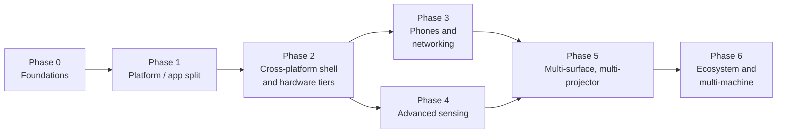

### Phase 0: Foundations (inside the current codebase)

Goal: fix the things that are cheap now and expensive later.

- Introduce the **scene format** (v1) with surfaces, warp meshes as 2x2 grids, and migration from `calibration.json` and `work_surface.json`.
- **Schema-first protocol**: one schema that generates the Pydantic models and the TypeScript types.
- Carry **capture timestamps** through all events.
- Move detection off the asyncio loop into **worker processes** reading frames from shared memory.
- Add **photon-to-photon latency measurement** to calibration.

Exit criteria: the craft mat behaves as today; latency is measured and shown; the protocol types are generated.

### Phase 1: Platform / app split

Goal: the craft mat becomes the first real app.

- First version of the **SDK** (connect, surface and units, markers, hands, pointers, grant).
- First version of the **broker** with manifests and grant negotiation, still in Python.
- **App sandbox** in the existing kiosk: each app in a cross-origin iframe on its own origin, with the shell drawing platform UI above it, and CSS mapping (render stage A).
- **Local app store**: install from a folder or archive, enable or disable, per-app permissions in the operator console.
- Port the craft-mat app to the SDK. Write a second, small sample app to make sure the SDK is not shaped around one app.
- The **simulator** for developing apps without hardware.

Exit criteria: the craft mat runs as a packaged app through the public SDK only; a third party could build an app from the docs and the simulator.

### Phase 2: Cross-platform shell and hardware tiers

Goal: run on mini-PCs and Linux, not just a Mac.

- **Electron shell** replaces the Chromium kiosk; per-app renderer processes and sessions.
- **Platform abstraction** for cameras, displays and services on macOS and Linux (Windows when there is demand).
- **Hardware profiling** at startup; ONNX Runtime with per-platform execution providers; graceful degradation of grants.
- **Supervisor** with auto-start, health checks and restarts; reproducible packaging (installer on macOS, package or image on Linux).
- Resource governance: watchdogs, frame-time monitoring, rate caps.

Exit criteria: the same apps run on an N100 mini-PC and a Mac, with different grants, unattended for days.

### Phase 3: Phones and networking

Goal: zero-effort phone participation.

- Companion pages in app packages; QR join; anonymous session tokens; gateway rate limiting.
- Phone pointers merged into the `pointers` capability.
- HTTPS modes from section 11.3: plain local and owner domain first.
- First remote-access extension (one provider, behind the generic interface).

Exit criteria: a visitor joins from a phone by scanning a QR code with no install; optionally, from cellular through an extension.

### Phase 4: Advanced sensing

Goal: reliable interaction on any surface and in any lighting.

- IR camera support; `touch` and IR-based `presence` providers.
- Stereo/depth providers; 3D `pose` in the world frame.
- Graded `video` grants delivered as `MediaStream`, with the console indicator.
- Camera intrinsics calibration; multiple cameras observing one surface, fused in the broker.
- Optional: projected-image subtraction for RGB cameras.

Exit criteria: a touch app works over changing projected content on IR-equipped hardware, and is cleanly refused on RGB-only hardware.

### Phase 5: Multi-surface and multi-projector

Goal: the "someday" features, without changing the app contract.

- Technical spike first: Electron offscreen rendering with shared textures, measured on each hardware tier.
- **Texture compositor** (render stage B) with warp meshes and blend masks in WebGPU.
- **Structured-light calibration** for dense warps, multi-projector overlap, and irregular surfaces.
- Several named surfaces in one scene; apps assigned per surface by the operator.
- Brightness and color matching across projectors.

Exit criteria: one app spans two edge-blended projectors on a non-flat surface, unchanged from its single-projector version.

### Phase 6: Ecosystem and multi-machine

- App catalogs as extensions; package signing; owner policies requiring signatures.
- Third-party capability providers with worker isolation.
- Optional extensions: identity, policy tiers, payments, broadcast-scale audiences.
- Multi-machine coordinator model.
- Rust rewrites of the supervisor, broker and capture service, where packaging or reliability shows the need.

## 16. Risks and open questions

| Risk or question | Mitigation or next step |
|---|---|
| Electron offscreen rendering may not meet frame-rate or latency targets on light hardware | Spike before Phase 5; stage A remains the fallback for single-projector setups |
| A schema-first protocol adds tooling friction early | Keep the generator simple; JSON Schema or a small IDL with codegen |
| Hand and pose quality on RGB under projected light | Report quality in grants; make IR the recommended path for body interaction |
| Visitor abuse via phones (spam, floods) | Session-scoped anonymous tokens, rate limits, operator kick and lock controls |
| App authors without hardware | Simulator and recorded sensor sessions from Phase 1 |
| Biometric data in non-home settings | Out of scope for the first, home-only phase; on-device processing and graded video grants keep the door open |
| Governance of the open-source project as extensions and catalogs appear | Define the extension interfaces and their stability policy before any central service exists |

## Appendix: from today's code to the target

| Today | Becomes |
|---|---|
| `server/main.py` mode state machine and run loop | Supervisor, broker and gateway; the frame loop moves into the capture service and workers |
| `server/camera.py` | Capture service |
| `server/cameras.py`, `server/displays.py`, `server/launcher.py` | Platform abstraction, macOS backend |
| `server/detection.py` (ArUco, MediaPipe hands) | `markers` and `hands` capability workers |
| `server/calibration.py`, `data/calibration.json`, `data/work_surface.json` | Scene store and calibration tools; the work surface becomes a surface's usable region |
| `server/protocol.py`, `ui/src/types.ts` | Generated from the protocol schema |
| `ui/src/projector/` | Shell: platform overlays, calibration patterns, surface mapping |
| Tracked-object overlays, hand overlay, glue logic | The craft-mat app (overlays), and broker-side tracking (glue and occlusion handling become part of `markers` tracking) |
| `ui/index.html` control panel | Operator console |
